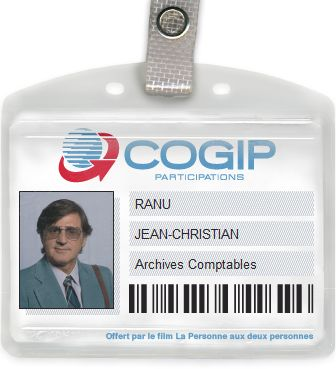

# Facturation
## An app for Jean-Christian Ranu

Nous venons d'aller un peu plus loin dans les bases de données, les tables, les requêtes SQL et surtout les connexions à la base de données.

Nous allons reprendre la base de données qu'on a créé à la fin de l'initiation MySQL2, celle qui se nomme "facturation".

## Base de données facturation
Pour rappel :

| personnes      |
| ------------- |
| id_personne     |
| nom_personne       |
| prenom_personne |
| tel_personne |
| email_personne |

| societes      |
| ------------- |
|  id_societe |
| nom_societe |
| adresse_societe |
| tel_societe |
| tva_societe  |

| factures |
| ------------- |
| id_facture |
| numero_facture |
| date_facture |
| bc_facture |

| type |
| ------------- |
| id_type |
| type |

**Notes**

- bc = bon de commande : Une facture, pour qu'elle soit approuvée par Ranu, doit correspondre à un bon de commande.
- Type : savoir si la société est un fournisseur ou un client
- Concernant les relations entre les tables, il faudra :
  - societes---type
  - societes---factures
  - personnes---factures
  - personnes---societes

## L'app pour Ranu

Avec cette base de données, on va faire une petite application (comme un site web) avec les pages suivantes :
- sociétés (societe.php),
- factures (facture.php),
- annuaire (annuaire.php),

### page d'accueil
Affichera :
- un message d'accueil pour Jean-Christian Ranu
- la liste des 5 dernières factures, classées par date (chaque facture renvoie avec un lien vers sa page detailfacture)
- la liste des 5 dernières personnes, encodées dans la base de données (chaque personne renvoie avec un lien vers sa page detailcontact)
- la liste des 5 dernières entreprises, encodées dans la base de données (chaque société renvoie à l'aide d'un lien vers sa page detailsociete)
- un lien vers la page fournisseurs
- un lien vers la page clients

### page sociétés
Affichera la liste des sociétés par ordre alphabétique.

Le nom de chaque société sera un lien qui renverra vers une nouvelle page detailsociete dont le contenu sera généré en fonction de l'id de la société choisie.

BONUS : On appliquera un filtre par types pour mieux trier les sociétés

### page factures
Affichera la liste des numéros de toutes les factures par date la plus récente vers la date la plus lointaine.

Chaque numéro de facture sera un lien qui, au clic, renverra vers une page detailfacture dont le contenu sera généré en fonction de l'id de la facture sélectionnée.

BONUS : On appliquera un filtre par société pour mieux trier les factures

### page annuaire
Affichera la liste de toutes les personnes de contact de la base de données, par ordre alphabétique.

Le nom de chaque personne sera un lien qui renverra vers une nouvelle page detailcontact dont le contenu sera généré en fonction de l'id de la personne choisie.

BONUS : On appliquera un filtre par société pour mieux trier les personnes de contact

### page fournisseurs
Affichera la liste de toutes les sociétés de type fournisseur. Chaque nom de société renvoie, à l'aide d'un lien, vers sa page detailsociete dédiée.

### page clients
Affichera la liste de toutes les sociétés de type client. Chaque nom de société renvoie, à l'aide d'un lien, vers sa page detailsociete dédiée.

### detailsociete
Affichera les informations suivantes selon la société choisie :
- nom de la société
- adresse de la société
- téléphone de la société
- numéro de TVA de la société
- compte bancaire de la société
- liste des factures liées à la société
- liste des personnes de contact travaillant dans la société

## detailfacture
Affichera les informations suivantes selon la facture choisie :
- numéro
- date
- bon de commande
- société liée à la facture
- type de la société liée à la facture (fournisseur ou client)
- numéro de compte bancaire de la société liée à la facture
- personne de contact liée à la facture

### detailcontact
Affichera les informations suivantes selon la personne de contact choisie :
- nom, prénom
- téléphone
- e-mail
- nom de la société où travaille la personne
- adresse de la société
- la liste des factures liées à la personne

### BONUS
Réaliser un petit design sympa pour notre ami Jean-Christian. Rappelez-vous que notre ami et client est comptable à la COGIP depuis plus de 20 ans !

